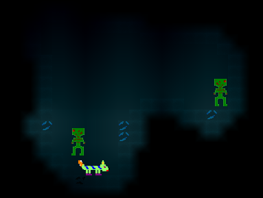
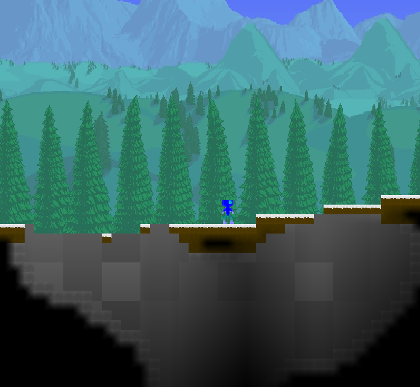
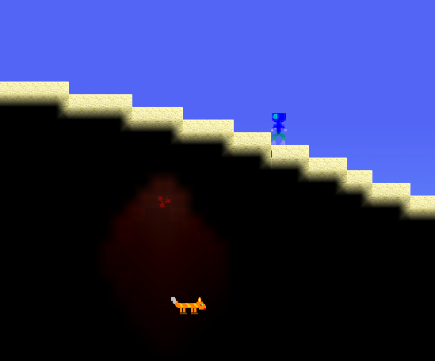
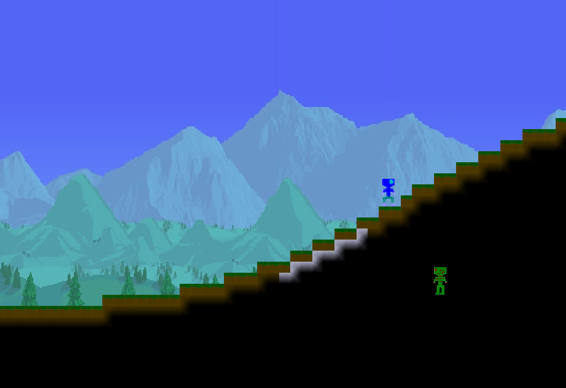
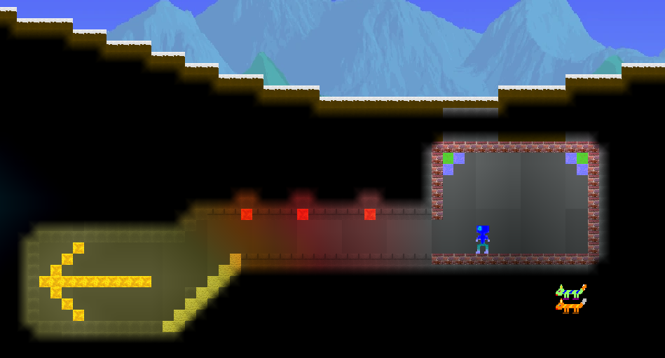

## Grandiose Dig

Grandiose Dig - 2D-игра, написанная на C++ с использованием 
[Qt framework (5.15.2+)](https://www.qt.io). Игра предназначена для ПК.

Это игра в жанре песочница, где можно выживать и создавать различные постройки,
добывая блоки. Остерегайтесь различных монстров и препятствий на вашем пути!

Игра является учебным проектом студентов 5 группы 1 курса факультета
прикладной математики и информатики БГУ (2 семестр 2020-2021): 
* Керножицкий Антон ([@Wind-Eagle](https://github.com/Wind-Eagle))
* Шишков Максим ([@degmuk](https://github.com/degmuk))
* Ульянов Алексей ([@mrboorger](https://github.com/mrboorger))
* Борисов Ярослав ([@yaroslaffb](https://github.com/yaroslaffb))

Основная стадия разработки завершена в мае 2021 года.

В программе используется музыка 
[Hajime Hyakkoku - Pinch Daisuki!](https://open.spotify.com/track/5tuINYmRZlIctuiA4ZMv6p)
